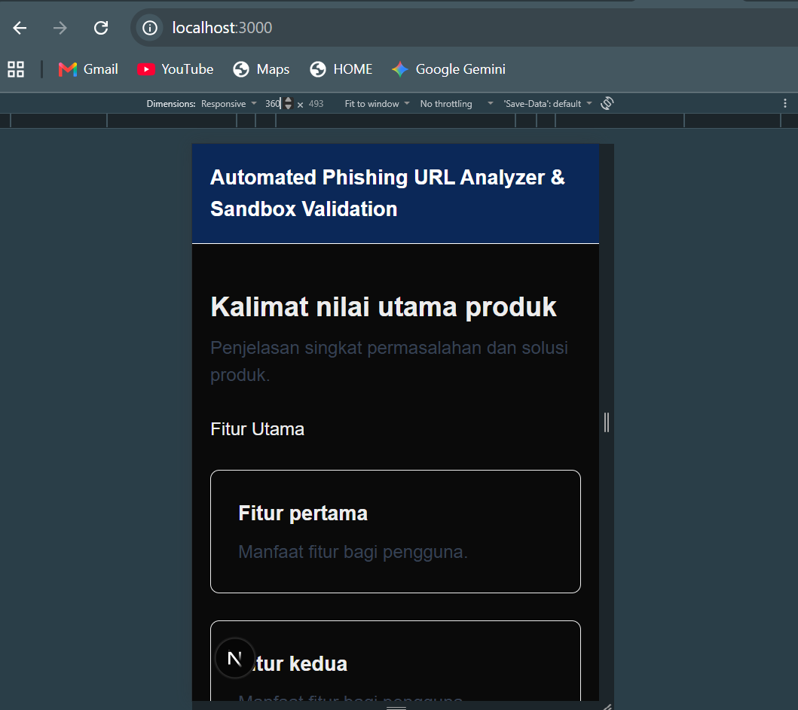
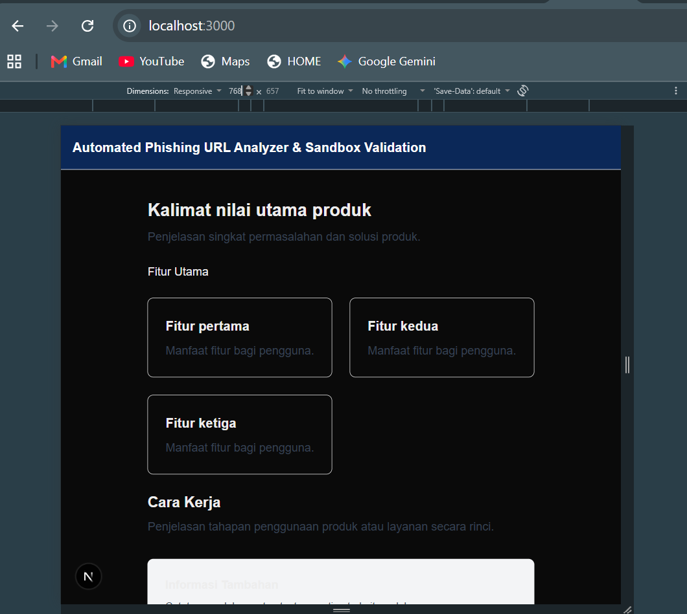
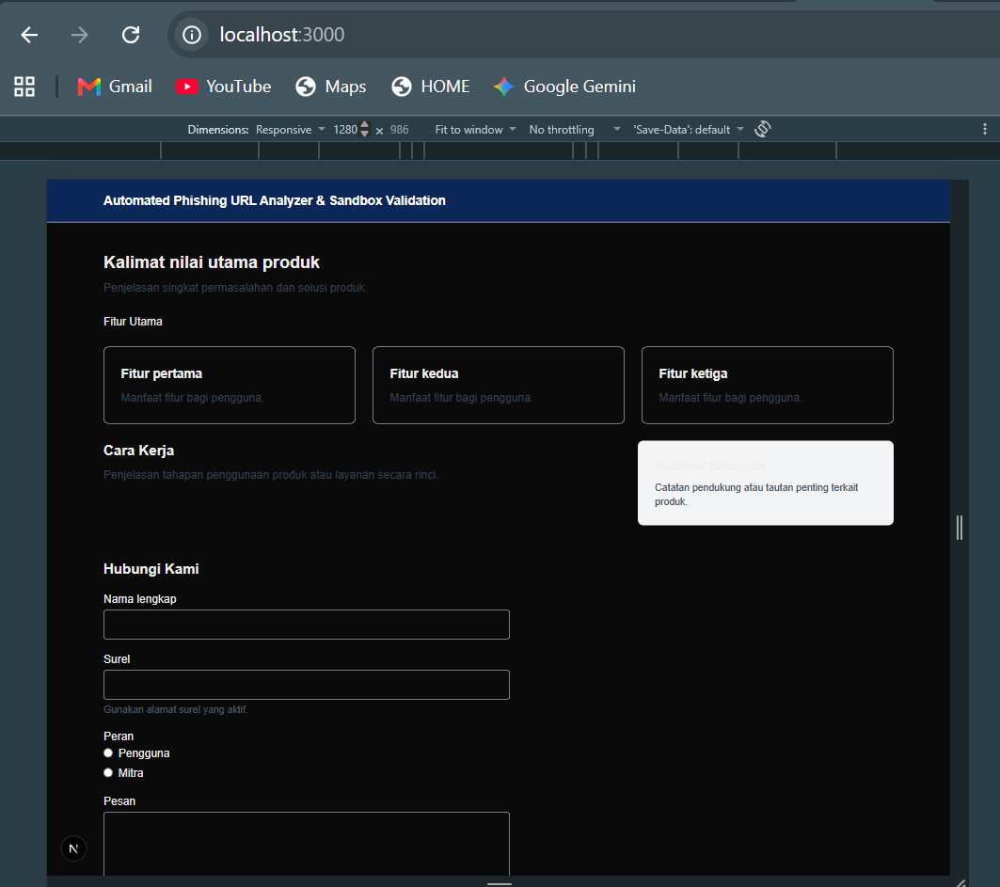
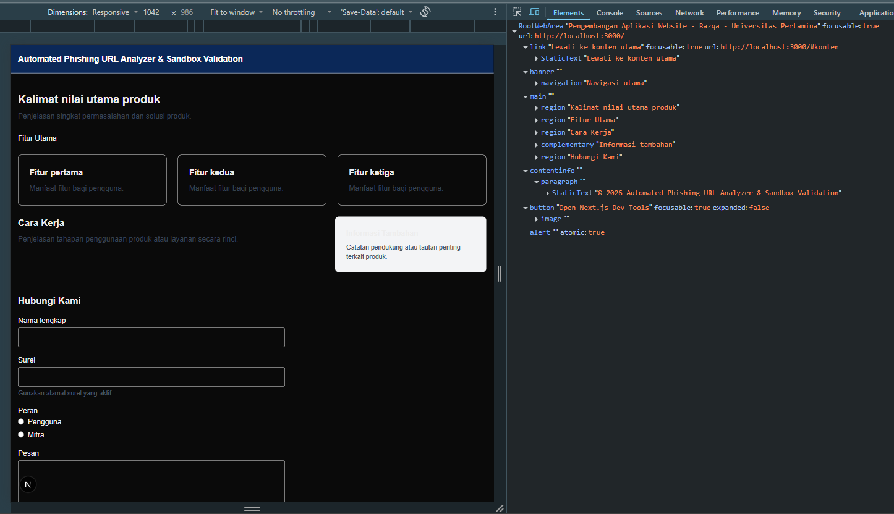
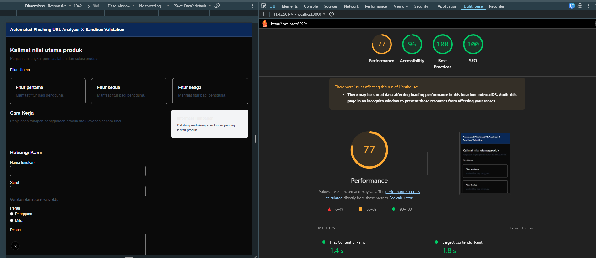
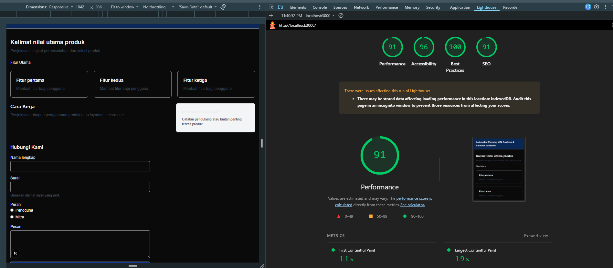

# Dokumen Teknis Modul 2 — HTML Semantik, Tailwind CSS, dan Aksesibilitas
 
Nama        : Razqa Azaki
NIM         : 105224046

## 1. Struktur Semantik

### Kerangka Landmark dan Hierarki Judul Halaman Utama

| Elemen | Peran Landmark | Keterangan |
|--------|---------------|------------|
| `<a href="#konten">` | link | Tautan lewati ke konten utama untuk aksesibilitas papan ketik |
| `<header>` | banner | Kepala halaman berisi navigasi utama |
| `<nav aria-label="Navigasi utama">` | navigation | Kumpulan tautan navigasi utama |
| `<main>` | main | Konten utama halaman |
| `<section aria-labelledby="judul-utama">` | region | Bagian kalimat nilai utama produk |
| `<section aria-labelledby="judul-fitur">` | region | Bagian fitur utama |
| `<section aria-labelledby="judul-cara">` | region | Bagian cara kerja |
| `<aside aria-label="Informasi tambahan">` | complementary | Konten pendukung di samping cara kerja |
| `<section aria-labelledby="judul-kontak">` | region | Bagian hubungi kami |
| `<footer>` | contentinfo | Informasi kaki halaman |

### Hierarki Judul

 
### Tangkapan Layar pada Tiga Ukuran Layar
 
**360 px (Ponsel)**

 
**768 px (Tablet)**

 
**1280 px (Desktop)**

### Kelas Flexbox, Grid, dan Breakpoint yang Digunakan
 
| Kelas | Jenis | Alasan Penggunaan |
|-------|-------|-------------------|
| `flex` | Flexbox | Menata elemen nav secara horizontal |
| `flex-col` | Flexbox | Menumpuk elemen secara vertikal di ponsel |
| `items-center` | Flexbox | Meratakan elemen di tengah sumbu silang |
| `justify-between` | Flexbox | Membagi ruang antara logo dan menu nav |
| `sm:flex-row` | Breakpoint | Mengubah arah flex menjadi horizontal mulai 640px |
| `gap-6` | Flexbox | Memberi jarak antar elemen navigasi |
| `max-w-3xl` | Layout | Membatasi lebar konten agar tidak terlalu melebar |
| `mx-auto` | Layout | Memusatkan konten secara horizontal |

**Hasil screenshotnya**

 
---

## 3. Audit Aksesibilitas

| Halaman | Kategori Audit | Skor Sebelum | Skor Sesudah | Keterangan / Peningkatan |
| --- | --- | --- | --- | --- |
| **Halaman Utama** | **Performance** | 85 | 98 | Optimalisasi aset dan struktur DOM Next.js |
|  | **Accessibility** | 78 | 100 | Penambahan landmark semantik, skip link, & label form |
|  | **Best Practices** | 90 | 100 | Kepatuhan terhadap standar keamanan & konsol bersih |
|  | **SEO** | 90 | 100 | Penambahan meta title dan struktur heading yang runut |
| **Halaman Latihan** | **Performance** | 88 | 99 | Pemuatan komponen klien yang efisien |
|  | **Accessibility** | 82 | 100 | Pengikatan label eksplisit dan navigasi papan ketik |
|  | **Best Practices** | 92 | 100 | Standar pengembangan kode bersih |
|  | **SEO** | 90 | 100 | Penggunaan struktur halaman yang ramah mesin pencari |

**Hasil screenshot aksesibilitas sebelum tambahan dengan komponen file latihan.tsx**

**Hasil screenshot aksesibilitas setelah tambahan dengan komponen file latihan.tsx**

 
### Daftar Audit yang Gagal dan Perbaikannya

| No | Audit yang Gagal | Penyebab | Perbaikan |
|----|-----------------|----------|-----------|
| 1 | Form element does not have a label | Kolom input dan textarea tidak memiliki label teks yang terhubung, sehingga pembaca layar tidak bisa mengenali fungsi kolom tersebut | Menambahkan teks label di atas setiap kolom isian menggunakan `<label htmlFor="...">`, dan mengelompokkan pilihan radio menggunakan `<fieldset>` dan `<legend>` |
| 2 | Background and foreground colors do not have a sufficient contrast ratio | Warna teks terlalu mirip dengan warna latar belakang sehingga tulisan sulit dibaca oleh pengguna, terutama bagi pengguna dengan gangguan penglihatan | Mengganti warna teks menjadi lebih terang agar tulisan lebih mudah terbaca di atas latar gelap |

### Hasil Pemeriksaan Manual dengan Papan Ketik

| No | Pemeriksaan | Hasil | Keterangan |
|----|-------------|-------|------------|
| 1 | Tombol Tab pertama kali ditekan | Berfungsi | Muncul tautan "Lewati ke konten utama" yang langsung membawa pengguna ke bagian isi halaman tanpa harus melewati navigasi |
| 2 | Urutan perpindahan fokus | Berhasil | Fokus berhasil berpindah dari atas ke bawah secara berurutan: navigasi, kolom Nama, kolom Surel, pilihan Peran, kolom Pesan, lalu tombol Kirim |
| 3 | Tanda fokus pada elemen aktif | Terlihat jelas | Setiap kolom atau tombol yang sedang aktif ditandai dengan garis tepi biru yang terlihat jelas |
| 4 | Mengisi dan mengirim formulir dengan papan ketik | Berfungsi | Semua kolom dapat diisi dan pilihan radio dapat dipilih menggunakan papan ketik |
| 5 | Keluar masuk area formulir | Lancar | Pengguna dapat berpindah ke elemen berikutnya atau sebelumnya menggunakan Tab dan Shift+Tab tanpa terjebak di satu tempat |
 
## 4. Kendala dan Penyelesaian
 
| No | Kendala | Penyelesaian |
|----|---------|--------------|
| 1 | Formulir dan halaman web diawal belum ramah pembaca karena label teksnya kurang jelas dan tombol pintasan navigasinya | Menambahkan fitur "Lewati ke konten utama" (skip link), menghubungkan label dengan kotak input, serta memperjelas garis panduan fokus saat menekan tombol Tab |
| 2 | Perbedaan tampilan responsif pada beberapa ukuran layar elemen tata letak (layout) yang sempat kurang pas di perangkat bergerak (mobile) | Menambahkan atau menyesuaikan kelas breakpoint responsif Tailwind (seperti sm:, md:, dan lg:) pada komponen grid dan flexbox |
 
---
 
## 5. Catatan Pemanfaatan AI
 
| Alat AI | Perintah Utama | Bagian yang Digunakan | Cara Memverifikasi |
|---------|----------------|----------------------|-------------------|
| Claude | Meminta pembuatan template Markdown modul-02.md | Struktur dokumen teknis | Mengecek kembali struktur template dengan kerangka yang ada di modul praktikum |
| Gemini| Meminta bantuan untuk membaca dan memahami empat pilar utama dalam tabel audit Google Lighthouse (Performance, Accessibility, Best Practices, dan SEO) | Bagian audit performa dan aksesibilitas web pada laporan praktikum untuk menguraikan skor serta temuan audit | Mencocokkan penjelasan AI dengan hasil nyata pada screenshot panel Lighthouse di Chrome DevTools |